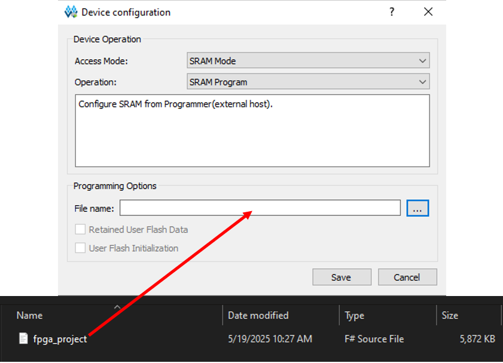

# vericore
Verilog modules for development and fun!


### Open Source Toolchain - apio
1. Install python
   - Check for python installation with `$python --version`
   - If error appears please install python distribution
2. Get apio
   - In terminal run `$pip install -U apio`
3. Install all software (yosys, GTKwave, nxtpnr) [hackster blog](https://www.hackster.io/dshardan007/getting-started-with-opensource-fpga-tool-chain-apio-yosys-5ce38a)
   - `$apio install --all`
   - [apio docs](https://apiodoc.readthedocs.io/en/stable/source/quick_start.html)
   - Confirm apio installation with `$apio --version`
   - Enable serial and ftdi drivers in system. Note this command may need to be run in a shell with admin privileges `$apio drivers --ftdi-enable`
   - Zadig window will pop up
     - Connect FPGA Dev Board to PC and select from drop down. You may need to select ***Options->List All Devices*** to see FPGA Dev Board
     - Select interface 0
     - Replace libusbk
      
      ###
   - To verify success, check `$apio system --lsftdi` (see below)
      
   - Once finished, you may close admin prompt
#### Resources
   - [apio documentation](https://apiodoc.readthedocs.io/en/stable/)
------------------------------------------------------------------------------
### New Apio Project
   1. Check list of all supported boards to ensure your Dev Board is there
     - `$apio boards --list`
     - Notable boards:
       - Alchitry-Cu
       - iCESugar-nano
   2. Use `$apio init --board <boardname>` to create a new apio project for that board. 
     - Please create a suitable directory as the apio toolchain is to verify, simulate, build, and upload bitstreams to FPGA device.
     - This will create a `apio.ini` file in the working directory
     - In this file you will be able to define the **top module** in your project.
     - Load all of your project files including **physical constraints file (.pcf)** into working directory.
   3. Once the project is set, run `$apio verify`
   4. Run `$apio sim` for simulation results (typically requres a testbench file)
   5. If everything looks okay you can build using `$apio build`
   6. To flash the FPGA with the build artifact run `$apio upload`
#### Resources:
   - [apio environment setup for fpgas](https://medium.com/robotics-devs/environment-setup-apio-for-fpgas-dd7702d83830)
   - [getting started with open source fpga tool chain](https://www.hackster.io/dshardan007/getting-started-with-opensource-fpga-tool-chain-apio-yosys-5ce38a)

-----------------------------------------------------------------------------
### Compiling and simulation with iverilog and gtkwave
This option is a good choice during the development phase where a board perhaps has not been chosen yet, but you want to test out your HDL.

1. **Compile verilog (.v) file** [Getting started with iverilog](https://steveicarus.github.io/iverilog/usage/getting_started.html)
   - `$iverilog -o <filename> <filename>.v`
   - Ex. `$iverilog -o hello hello.v`
   - File named `hello` will be found in same working directory
   - For compiling a list of files (as in the case of testbenches and modules), there are two options:
     - **Option 1**: `$iverilog -o <filename> <filename>.v <filename>.v`
       - Example where there is a `counter_tb.v` and `counter.v` files: `$iverilog -o my_design  counter_tb.v counter.v`
     - **Option 2**: Create a text file with any name e.g. `file_list.txt` in working directory
       - In **.txt** file, include all the file names (one per line)
       - Example in *file_list.txt*
            ```
            counter.v // module
            counter_tb.v // Testbench 
            # End of file
            ```
            **Note** that the comments after each file name are needed to prevent compilation issues. `# End of file` comment also included at end for the same reason.
        - Once this file is created run `$iverilog -o <filename> -c <txtfilename>`
        - Ex. `$iverilog -o hello -c file_list.txt`
        - A file named `hello` will be created in working directory.

2. **Execute compiled program with vvp**
   - To execute compiled program from Step 1, run `$vvp <filename>`
   -  Ex. `$vvp hello`
   -  Terminal will display output (if defined in testbench). Best practice is to wrap project in a test bench.
3. **GtkWave**
   - If you want to see simulation data from a test bench, a **.vcd** file must be dumped when running a compiled file from Step 1 that includes a (*_tb.v file).
   - To dump a **.vcd** file, be sure to include the following somewhere in the testbench to be compiled (from Step 1):
     ```verilog
     initial
        begin
        $dumpfile("test.vcd");
        $dumpvars(0, test);
        end
        ```
        Then repeat the same command: `$vvp <filename>` from Step 2. A **.vcd** file will be generated in the working directory.

    - To open simulation file in gtkwave, run `$gtkwave <filename>.vcd`
    - Ex. If the code above was included in the testbench compiled prior to running vpp command, then the command to open simulation results would be `$gtkwave test.vcd`
    - GtkWave application window will open
    - TODO: Insert example images below
----------------------------------------------------------------------------
#### Gowin IDE
Necessary for the mighty Tang Primer 25k. 
1. #### Install Gowin (educational) [GoWin Downloads Page](https://www.gowinsemi.com/en/support/download_eda/). Note: Must create an account.
   - During installation, you may be prompted to install two windows drivers. It is important that you restart your machine prior to attempting to flash or upload your bitstream to the device.
2. #### Create a Project
   Once installed, create a new project.
   - Select Tang Primer 25K board for project. Example Design Summary once project is set up: 
      
   - Load all project files. Note that you can enable or disable files as needed for testing/development. Example:
      
   - Once all files have been uploaded, use the `Run Synthesis`, `Run Place & Route`, or `Run All` to generate bitsream binary.
      
      - Logs will appear in the GoWin terminal at the bottom (default) of the screen.
      - If you get an error for clock pin E2 (Tang Primer 25K; may be other pin for other FPGA boards), it is most likely related to its type being `CPU/SSPI`. To fix this, go to Project -> Configuration -> Dual-Purpose Pin. Here you want to ensure both `Use SSPI as regular IO` and `Use CPU as regular IO` options are selected. Once both are selected, click `Apply` button at the bottom of the Configuration window and exit.
      
      - Now you should not see the error appear when you run the place and route.
3. #### Generating Bitsream
   Now you are ready to generate the bitsream for your FPGA project. Double check you have the correct device selected.
   - In the `Process` tab you will see all the reports for your project. Please review them as necessary to ensure design functions as expected. The tool may sometimes optimize bit array widths or lengths as it sees fit according to the design files provided. You can also see FloorPlanner to see the actual FPGA areas that will be used for your logic.
      
   - In **Place & Route**, you will be able to see resource usage per your device, including I/O Bank usage, etc. Give this a view to see what's happening inside of your FPGA.
   - In **Timing Analysis**, you will see timing details related to your design including clk frequencies, Path Slacks, Minimum Pulse Width, and other important analyses to help validate your design or even troubleshoot in the future.
   - Once everything looks good, you can click the `Programmer` button to open up the GoWin programming tool.
4. #### Programming
   Once the window opens you will see the programming interface. Note you can have multiple devices to program. We will be doing only one.
   - In the main window you should be interested in the following buttons `Scan Device`, `Program/Configure`, and `USB Cable Setting`. Example below:
      
   - Please select `USB Cable Setting` to ensure there is a properly connected USB cable connected. The following window pops up. Click `Query/Detect Cable`. You'll see logs appear in the **Output** terminal at the bottom of the Gowin Programmer window. `Cable found: lorem ipsum` is good. If you don't see this or you see **red** text, then please check your cable connection.
   - Once cable is found and you see the correct logs in the **Output** terminal you are ready to scan for your device. Please click the `Scan Device` button to scan for your device. For the Tang Primer 25K board, the following prompt appears - please select the correct one. Logs will also appear in the **Output** - **Blue** is good, **Red** is not (may happen if you don't restart your computer after driver installation. Please restart.):
      
   - You are one step closer. Now you must select the **Operation** for programming/configuring the FPGA. The two options we're concerned about are **SRAM Mode** and **External Flash Mode**. 
     - **SRAM Mode** is good for development and testing. This uses the SRAM memory to program the device.** Note** that this is *volatile* so on power cycles, the FPGA will need to be reprogrammed. It is also much faster than programming using External Flash.
     - **External Flash Mode** is good for production bitstreams. It will program the bitstream binary in the FPGAs external flash memory. This memory is *non-volatile* so power cycling the device will retain the programmed bitstream - ready to use in your production system! 
      **Note** that for this longer procedure, you must *Erase, Program, and Verify* to ensure the FPGA external flash memory is wiped before reprogramming with your latest bitstream.
      Example selecting **SRAM Mode Operation**
      
   - Once you've selected the appropriate Operation for your use case, you can now select the ***FS File*** to program the FPGA. You may have been required to select the file when selecting the **Operation**, but if not, you can select it by clicking **FS File**. Navigate to where your project has dumped the *F# Source File* type and select `Open` or just enter the path to the directory if you're feeling hardcore. **Note** that this file should be found in the ./impl/pnr directory (relative to your Gowin project's root directory).
      Example below:
      
   - Now you can selct the `Program/Configure` button. You will see logs in the **Output** and a loading screen to show you progress of programming your FPGA. Congrats!
      **Note** if there are any issues with this, ensure:
      - Correct device is selected
      - Device is detected when Scanning for Devices
      - Cable is not faulty and remains connected throughout programming procedure
---
### VSCode Setup and Extensions
[TerosHDL](https://terostechnology.github.io/terosHDLdoc/docs/intro/)
[BitFontMaker2](https://www.pentacom.jp/pentacom/bitfontmaker2/editfont.php?id=4677&ref=learn.lushaylabs.com)